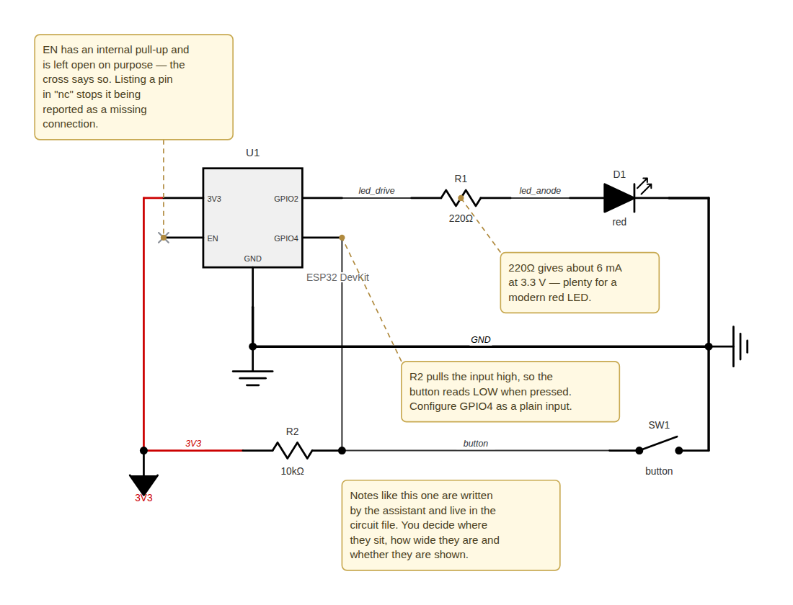

# CircuitStudio

A schematic editor built around a simple split of labour:
**the language model does the wiring, you do the layout.**

Large language models are good at describing what connects to what. They are
bad at arranging that into a drawing a human enjoys looking at. CircuitStudio
keeps those two jobs in separate files, so neither side overwrites the other.



## The idea

| File | Contains | Owned by |
|------|----------|----------|
| `<name>.circuit.json` | components, nets, notes, no-connects | the assistant |
| `<name>.layout.json` | positions, rotation, wires and their waypoints, note boxes | you |

The assistant can rewrite the circuit at any time and your arrangement survives:
components are matched by ID, so anything already placed stays where you put it,
and only new parts get an automatic position (marked orange in the editor).
Conversely, dragging things around never touches the electrical description.

The editor watches the circuit file, so changes from the assistant show up live
in the browser.

## Quick start

Requires **Python 3.10 or newer**. No third-party packages.

```
start.bat
```

or

```
python -m circuitstudio [project] [--port 8730] [--no-browser]
```

The browser opens automatically. The console window stays open — closing it
stops the editor. If that project is already open in a running editor, the
existing one is shown instead of starting a second (two editors would keep
overwriting each other's layout); `open_editor` from the assistant behaves the
same way.

## Connecting an assistant (MCP)

CircuitStudio ships an MCP server so an assistant can create and edit circuits
directly. It works on the JSON files, so it does not care whether the editor is
currently running.

**Claude Desktop** — add to `claude_desktop_config.json`:

```json
{
  "mcpServers": {
    "circuitstudio": {
      "command": "python",
      "args": ["/absolute/path/to/CircuitStudio/circuitstudio_mcp.py"]
    }
  }
}
```

**VS Code** — add to `.vscode/mcp.json`:

```json
{
  "servers": {
    "circuitstudio": {
      "type": "stdio",
      "command": "python",
      "args": ["${workspaceFolder}/CircuitStudio/circuitstudio_mcp.py"]
    }
  }
}
```

Tools: `list_projects`, `list_component_types`, `get_circuit`, `write_circuit`,
`update_circuit`, `open_editor`, `review_project`.

`update_circuit` edits an existing netlist in place — add, replace or remove
parts, nets and notes, connect or disconnect pins, mark pins as no-connect — so
the assistant does not have to resend the whole circuit for a small change.
Removing a part also drops its pins from every net; connecting a pin that
already sits in another net moves it rather than creating a short.

`write_circuit` validates before it writes. Unknown component types, wrong pin
names, bad note anchors, duplicate IDs, duplicate net names and pins that sit in
two nets at once (a short) are rejected with a precise message and nothing is
saved — which gives the model a chance to correct itself instead
of leaving a broken file behind:

```
NOT written — please fix:
- Unknown component type 'widerstand' for 'R1'. Known types: ...
- Net 'GND': 'U1' has no pin 'MASSE'. Available: GND, TRG, OUT, RST, CTL, THR, DIS, VCC
```

On top of that it runs a rule check and reports what is questionable rather than
wrong — a pin nobody wired up, a net name typo that quietly split one node in
two (each half then connects a single pin), a part wired to nothing:

```
1 warning(s):
- R2.2 is not connected to anything. Wire it up, or list it in "nc" to mark it
  as deliberately open.
```

## Getting the result back to the assistant

The automatic arrangement is not worth showing anyone — it exists so you have
something to drag around, nothing more. So the assistant does not get to see it.

When your layout is ready, press **Hand back ✓**. The browser renders the
schematic to a PNG, and `review_project` then returns that picture together with
the rule check. The assistant sees the drawing you actually made and can check
its own wiring against it.

The button turns green while the picture is current and amber again as soon as
you move something, so it is always clear whether the assistant is looking at
the latest state.

(The rasterising happens in the browser on purpose: Python cannot turn SVG into
a bitmap without a rendering library, and this app has no dependencies. The
browser is already here and is the thing that defines what the drawing looks
like, so the result is WYSIWYG by construction.)

## Circuit format

```json
{
  "title": "ESP32 with status LED and button",
  "components": [
    { "id": "U1", "type": "esp32", "value": "ESP32 DevKit",
      "pins": { "left": ["3V3", "EN"], "right": ["GPIO2", "GPIO4"], "bottom": ["GND"] } },
    { "id": "R1", "type": "resistor", "value": "220Ω" },
    { "id": "D1", "type": "led", "value": "red" },
    { "id": "GND1", "type": "ground" }
  ],
  "nets": [
    { "name": "led_drive", "pins": ["U1.GPIO2", "R1.1"] },
    { "name": "led_anode", "pins": ["R1.2", "D1.anode"] },
    { "name": "GND", "pins": ["U1.GND", "D1.cathode", "GND1.pin"] }
  ],
  "notes": [
    { "id": "N1", "text": "220Ω gives about 6 mA at 3.3 V.", "anchor": "R1" }
  ],
  "nc": ["U1.EN"]
}
```

This is the `esp32_led` project that ships with the repository — open it to see
the result.

Pins are referenced as `ComponentID.PinName`. Call `list_component_types` for
the exact pin names of every symbol.

`nc` lists pins that are meant to stay unconnected. They get the standard
no-connect cross in the drawing and stop being reported as a missing connection
— the difference between "left open on purpose" and "forgotten" is worth saying
out loud. For the reason behind it, anchor a note to the same pin.

Nets named `VCC`, `VDD`, `3V3`, `5V`… are drawn red; `GND`, `VSS`… black and
thicker.

ICs, connectors and board symbols (`esp32`, `rpi`, `pico`, `arduino_uno`,
`arduino_nano`) take their pins from the circuit file:

```json
{ "id": "U1", "type": "esp32",
  "pins": { "left": ["3V3", "EN"], "right": ["GPIO2"], "bottom": ["GND"] } }
```

## Editor

| Action | How |
|--------|-----|
| Move | drag a part |
| Select several | drag a frame on empty space, or shift-click |
| Pan / zoom | space or middle-drag / mouse wheel |
| Rotate, mirror, lock | `R` (`Shift+R` the other way), `M`, `L` — several selected parts turn as one group; locked parts also survive **Auto-arrange** |
| Nudge | arrow keys (shift = 5 steps) |
| Undo / redo | `Ctrl+Z` / `Ctrl+Y` or `Ctrl+Shift+Z` |
| Align / distribute | toolbar, relative to the first selected part |
| Guide a wire | click it to add a waypoint, drag the waypoint, double-click to remove |
| Redraw all wires | **Reroute** — forgets the stored wires and routes everything afresh |
| Trace a net | hover a wire — the whole net stays lit and its pins are listed |
| Spot loose ends | pins in no net get a dashed red ring (**Open pins**) |
| Finish | **Hand back ✓** — renders a picture the assistant can review |
| Export | **Export SVG**, written next to the project |

Dragging snaps to the grid, but pin alignment wins over the grid (for parts
and for wire waypoints alike): when a pin
lines up with a pin of another part, a guide appears and it snaps exactly.
That matters because pin pitches differ between symbols — without it, some pins
could never be aligned and wires would zigzag for no reason.

Wires are routed automatically and then stored in the layout. Moving a part
only reroutes the wires attached to it (and any stored wire it now lands on);
everything else stays exactly where it was — which keeps the drawing calm and
large schematics fast.

Junction dots are placed where three or more conductors of the same net meet.
Wires of different nets that merely cross deliberately get no dot.

## Notes

Notes are written by the assistant and live in the circuit file, so explanations
stay with the schematic instead of getting lost in a chat log. They can be
anchored to a component (`"anchor": "R1"`) or to a single pin
(`"anchor": "U1.GPIO25"`); the connection is drawn as a dashed diagonal line,
which can never be mistaken for a wire since wires are solid and orthogonal.

You control position, width and visibility. Hiding a note also removes it from
the exported SVG.

## Project layout

```
circuitstudio/
  symbols.py     component symbols, pins, mirroring
  registry.py    type name -> symbol
  document.py    the two JSON documents, merging, auto-placement
  router.py      orthogonal routing (A*) and junction detection
  erc.py         rule check: open pins, split nodes, dead nets
  scene.py       geometry; feeds both the editor and the SVG export
  server.py      local HTTP server (127.0.0.1 only)
  mcp_server.py  MCP server for assistants
  web/           the editor UI
projects/        your circuits
```

The editor and the exported SVG are generated from the same geometry, so what
you arrange is exactly what you get.

## Tests

```
python -m unittest discover tests
```

Standard library only, like the rest of the project.

## Credits

The symbol library and the orthogonal router started life in a predecessor
project and were carried over largely unchanged.

## License

Apache License 2.0 — see [LICENSE](LICENSE).
